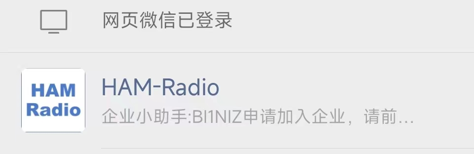

# Intro
感谢https://github.com/k0swe/wsjtx-go 提供的代码，本项目是基于此项目的修改，通过企业微信的方式接收新的DXCC的通知。

# How To
## 申请加入企业微信
1. 发邮件给我(bi1niz at hotmail.com)，提供你的呼号，我会把你加入到一个名为"Ham-Radio"的企业微信的"企业"里，然后你就可以收到通知了。为什么使用企业微信，因为它可以直接推送消息又可以集成到个人微信里。
2. 使用微信扫描以下二维码，加入到企业微信的"企业"里，然后你就可以收到通知了。

3. 等待我确认你的呼号，然后你就可以在你的微信里看到一个名为”Ham-Radio“的企业号：

## 配置JTDX
1. 修改JTDX->设置->报告->主要UDP服务器的地址为239.255.0.0
2. 修改GridTracker->设置->常规->接收UDP设置，勾选组播，IP设置为239.255.0.0
通过以上修改，JTDX与GridTracker就可以通过UDP组播的方式发送数据到本程序。